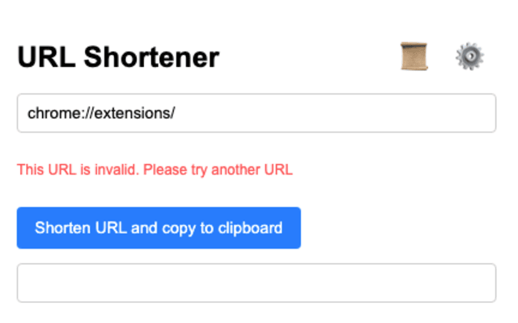
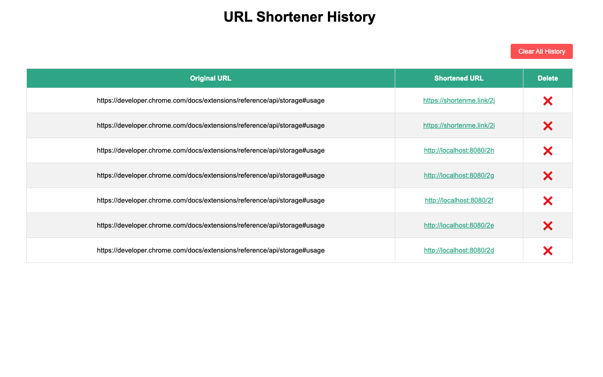
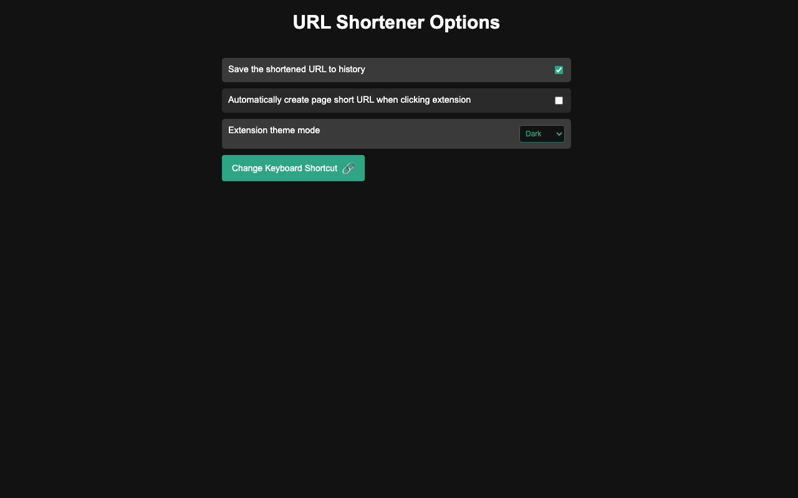

# ShortenMe Chrome Extension

  

This is a simple Chrome extension that allows you to shorten URLs using the ShortenMe API. It provides a popup interface where you can enter a URL, and it will return the shortened version of that URL.

Check out the [ShortenMe](https://shortenme.link) for more information.

## Features
- Shorten URLs using the ShortenMe API
- Automatically copy the shortened URL to clipboard
- Display the shortened URL in the popup
- History of shortened URLs
- Customizable settings
- Dark mode support

## Installation
Visit the [Chrome Web Store](https://chromewebstore.google.com/detail/eiojbnimgocofgaecddahbbneamkcedi?utm_source=item-share-cb) to install the ShortenMe extension.

## Screenshots

  
  
  
  

## Contributing

1. Fork the repository
2. Create your feature branch (`git checkout -b feature/amazing-feature`)
3. Commit your changes (`git commit -m 'Add some amazing feature'`)
4. Push to the branch (`git push origin feature/amazing-feature`)
5. Open a Pull Request

## License

This project is licensed under the MIT License - see the [LICENSE](LICENSE) file for details.
